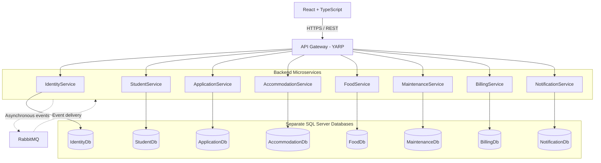

# Student Center

**Student Services Management System**

`.NET 8` · `React` · `TypeScript` · `SQL Server` · `RabbitMQ`

A microservices-based web application for managing student accommodation, dining, maintenance, billing, and administrative services.

## Overview

Student Center is a web application for managing student center services, developed as a diploma project. It supports student profiles, accommodation applications and ranking lists, room assignments, meals, maintenance requests, billing, and notifications.

The interface is in English. Students access their own records, while staff and administrators manage services according to their assigned permissions.

## Architecture

The application uses a microservice architecture. The React frontend communicates with backend services through an API Gateway built with YARP. Services use HTTP/REST for direct requests and RabbitMQ for asynchronous events, such as transferring accommodation eligibility after final ranking publication.

Each backend service has its own SQL Server database. Backend code is organized into API, Application, Domain, and Infrastructure layers.



The RabbitMQ connections represent messaging between participating services, not a requirement that every service publishes and consumes events. Direct service-to-service HTTP calls are omitted for readability.

## Technology Stack

| Area | Technologies |
| --- | --- |
| Backend | C#, .NET 8, ASP.NET Core Web API |
| Frontend | React, TypeScript, Vite |
| Persistence | Entity Framework Core, SQL Server |
| Gateway | YARP Reverse Proxy |
| Messaging | RabbitMQ |
| Authentication | JWT access tokens and refresh tokens |
| Email | SMTP |
| Testing | NUnit |

## Microservices

The frontend provides the student portal and staff administration interface. ApiGateway routes its requests to the following eight backend services:

| Service | Responsibilities |
| --- | --- |
| IdentityService | Registration, login, JWT and refresh tokens, roles, permissions, and account management |
| StudentService | Student profiles, academic information, and student search |
| ApplicationService | Accommodation competitions, applications, documents, scoring, ranking lists, and appeals |
| AccommodationService | Dormitories, rooms, eligibility decisions, room assignments, move-ins, and move-outs |
| FoodService | Restaurants, menus, monthly meal entitlements, paid purchases, and consumption records |
| MaintenanceService | Problem categories, student maintenance requests, workers, assignments, and interventions |
| BillingService | Charges, received payments, outstanding balances, and payment history |
| NotificationService | In-app notifications and optional email delivery |

## Key Features

- Registration with first name, last name, and a unique student index number
- Student profile management and search by name or index number
- Accommodation applications, document review, scoring, preliminary rankings, appeals, and final rankings
- Room assignment and move-in/move-out records
- Meal purchases, available meal balances, consumption history, and menus
- Maintenance reporting, worker assignment, and intervention tracking
- Accommodation and other charges, payment recording, and balance overview
- In-app notifications and email notifications when configured
- User administration, role and permission management, and account deletion with linked historical records retained

## Business Rules

- **Accommodation applications:** students apply for accommodation competitions. Preliminary rankings are published before the appeal period ends. All appeals must be resolved and the deadline must pass before the final ranking can be generated. Accepted appeals require a current document review and a new score calculation.
- **Room allocation:** final ranking publication transfers eligibility decisions to AccommodationService through RabbitMQ. Staff then assign rooms and record move-in; ranking publication does not automatically allocate a room.
- **Meals:** new entitlements start with zero meals. Only a recorded paid purchase increases the balance. Consumption reduces the remaining quantity, and entitlements expire after their designated month. Existing balances created before this rule was introduced are retained.
- **Payments:** staff record payments already received. The application does not process online card or bank payments, and paid meal purchases do not create outstanding billing charges.
- **Accommodation charges:** a charge refers to a student's accommodation assignment, not just a room. Only one accommodation charge is allowed per assignment and billing month.
- **Maintenance:** students need a recorded move-in and active accommodation to report a problem. An active problem category must also be available.

## Project Structure

```text
Student-center/
├── frontend/                  # React application
│   └── src/                   # Pages, components, authentication, API helpers
├── ApiGateway/                # YARP routing configuration
├── IdentityService/
├── StudentService/
├── ApplicationService/
├── AccommodationService/
├── FoodService/
├── MaintenanceService/
├── BillingService/
├── NotificationService/
├── BuildingBlocks/            # Shared messaging and security code
├── *.Tests/                   # Backend test projects
└── StudentCenter.sln
```

Backend services separate HTTP controllers (`API`), use cases and DTOs (`Application`), business entities and rules (`Domain`), and persistence and external integrations (`Infrastructure`). Database migrations are stored under each service's `Infrastructure/Persistence/Migrations` directory.

## Getting Started

### Prerequisites

- .NET 8 SDK
- Node.js 22.12 or later and npm
- SQL Server or SQL Server Express
- RabbitMQ, with the required Erlang runtime when installed locally
- Visual Studio with ASP.NET development tools, or another .NET-compatible editor

### Local Configuration

Create an `appsettings.Development.json` file in each backend service. Use the included `appsettings.Development.example.json` files where available, or copy the service's `appsettings.json` and fill in the local settings.

Configure a separate database connection for each service:

| Service | Connection string key | Suggested database |
| --- | --- | --- |
| IdentityService | `IdentityDb` | `StudentCenter.IdentityDb` |
| StudentService | `StudentDb` | `StudentCenter.StudentDb` |
| ApplicationService | `ApplicationDb` | `StudentCenter.ApplicationDb` |
| AccommodationService | `AccommodationDb` | `StudentCenter.AccommodationDb` |
| FoodService | `FoodDb` | `StudentCenter.FoodDb` |
| MaintenanceService | `MaintenanceDb` | `StudentCenter.MaintenanceDb` |
| BillingService | `BillingDb` | `StudentCenter.BillingDb` |
| NotificationService | `NotificationDb` | `StudentCenter.NotificationDb` |

Use the same JWT issuer, audience, and signing key across the services. Set your own signing key and configure `InitialAdmin` in IdentityService to create the initial administrator account on startup.

For services with a `RabbitMQ` configuration section, enable messaging and provide the local broker connection settings. See [RabbitMQ configuration example](BuildingBlocks/Messaging/rabbitmq.example.json). RabbitMQ is required for the complete workflow between services.

Email delivery is optional. Configure SMTP in NotificationService using the [email configuration example](NotificationService/email-settings.example.json) and set the matching `InternalServices:NotificationKey` in NotificationService and StudentService when enabling email.

Local `appsettings.Development.json` and `.env` files are ignored by Git. Keep passwords and other secrets in local configuration, not in committed files.

### Backend

1. Start SQL Server and RabbitMQ.
2. Trust the local HTTPS development certificate:

   ```bash
   dotnet dev-certs https --trust
   ```

3. Open `StudentCenter.sln` in Visual Studio.
4. Configure multiple startup projects: ApiGateway and all eight backend services listed above. Use their project launch profiles.
5. Start the projects. Entity Framework Core migrations are applied automatically at startup; the configured SQL account must have permission to create or update the databases.

Alternatively, run each project in a separate terminal, for example:

```bash
dotnet run --project IdentityService --launch-profile IdentityService
```

Repeat for the remaining services and ApiGateway using their corresponding project and profile names. Keep all services running for the complete application workflow.

The gateway is available at `https://localhost:50386`. Backend services expose Swagger in the Development environment at their respective `/swagger` addresses. Service ports are defined in their `Properties/launchSettings.json` files, and gateway destinations are configured in `ApiGateway/appsettings.json`.

### Frontend

Create `frontend/.env` with:

```dotenv
VITE_API_BASE_URL=https://localhost:50386
```

Then run:

```bash
cd frontend
npm install
npm run dev
```

Open `http://localhost:5173`. Sign in with the administrator credentials configured in IdentityService, or register a student account.

## Authentication & Authorization

IdentityService handles registration, password hashing, login, JWT access tokens, and refresh tokens. Backend services validate token signatures, issuer, audience, and expiration.

| Role | Access |
| --- | --- |
| Student | Own profile, applications, accommodation, meals, maintenance requests, billing records, and notifications |
| Staff | Administrative operations allowed by assigned permissions, such as `ManageAccommodation` or `ManageBilling` |
| Admin | User administration and service management through the configured authorization policies |

Authorization is enforced by the backend. Hiding a page or button in the frontend is not the access-control mechanism. Protected service requests also check the current account state through IdentityService so that disabled accounts and outdated role or permission claims are rejected.

## Testing

Run the backend tests from the repository root:

```bash
dotnet test StudentCenter.sln
```

Check the frontend TypeScript compilation and production build:

```bash
cd frontend
npm run build
```
